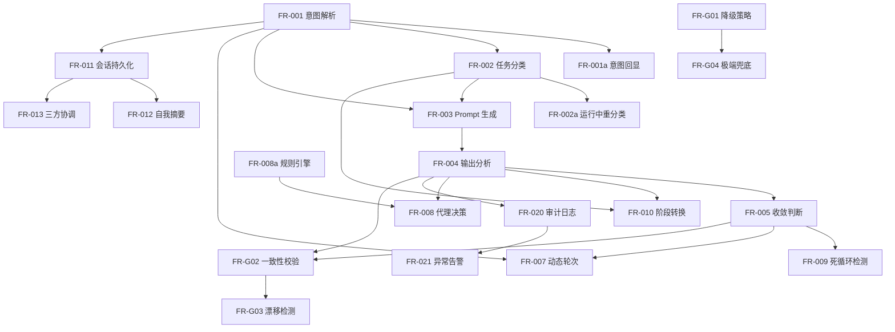

# God LLM Orchestrator — 智能编排引擎需求文档

> **版本**: v1.1
> **日期**: 2026-03-11
> **状态**: Draft
> **Pipeline**: auto-requirement → auto-todo → auto-dev

---

## 1. Executive Summary

### 问题

当前 duo 系统使用硬编码的 ContextManager、ConvergenceService、ChoiceDetector 控制 Coder/Reviewer 的协作流程。该架构存在根本性缺陷：**无法理解用户意图**。典型案例：用户要求"两个 AI 探讨需求"，但 Coder 直接将需求生产并开发完成，完全违背用户意图。

### 解决方案

引入 **God LLM** 作为智能编排层，**完全替换**现有三个硬编码组件，用 LLM 驱动的决策替代规则驱动的流程控制。架构从 2-LLM（Coder + Reviewer）升级为 3-LLM（God + Coder + Reviewer）。

**关键架构原则**: God 与 Coder/Reviewer 使用**同一套 CLI adapter 机制**（如 `claude -p` 或 `codex exec`），用户可自由选择哪个 CLI 工具担任 God 角色。不绑定特定 SDK，保持对任意 CLI 工具的兼容性。

### 成功指标

| KPI | 目标值 | 度量方式 |
|-----|-------|---------|
| 意图分类准确率 | ≥ 90% | 用户未触发 reclassify 的会话占比 |
| 任务完成满意度 | ≥ 80% | 用户未在完成前 Ctrl+C 强退的会话占比 |
| God 可用性 | ≥ 90% per session | God CLI 调用成功率 |
| God 响应延迟 P95 | < 10s | God CLI 调用耗时 |
| 成本可观测性 | 100% | 所有会话有决策审计日志 |

---

## 2. Strategic Goals & Traceability

```
SG-1: 用智能 LLM 编排替代硬编码流程控制
  ├── CD-1: Intent Understanding（意图理解）
  ├── CD-2: Decision Orchestration（决策编排）
  └── CD-G: God Reliability & Degradation（可靠性与降级）

SG-2: 实现全自主工作流，无需人类干预
  ├── CD-2: Decision Orchestration（决策编排）
  └── CD-4: User Interface & Transparency（界面与透明性）

SG-3: 持久化 God LLM 会话，支持跨会话恢复
  ├── CD-3: State & Session Management（状态与会话管理）
  └── CD-5: Cost & Observability（成本与可观测性）
```

---

## 3. User Personas & Scenarios

### Persona 1: 独立开发者

- **场景 A (explore)**: "帮我探讨一下这个 API 的设计方案" → 期望两个 AI 来回讨论，输出设计方案而非代码
- **场景 B (code)**: "实现用户登录功能" → 期望 Coder 写代码，Reviewer 审查，直到收敛
- **场景 C (explore-to-code)**: "先探讨一下，然后实现" → 期望自动从讨论切换到编码
- **场景 D (resume)**: 第二天 `duo resume` → 期望完整恢复之前的状态和 God 的决策记忆

### Persona 2: 团队 Lead

- **场景 E (review)**: "审查这个 PR 的代码质量" → 期望 Reviewer 提供审查意见，Coder 不修改代码
- **场景 F (god-config)**: `duo start --god codex --coder claude-code --reviewer claude-code "重构模块"` → 用 Codex 做编排者，Claude Code 做执行者

---

## 4. Capability Domains & Feature Hierarchy

### CD-1: Intent Understanding（意图理解）

**traces_to: SG-1** | **complexity: Deep** | **priority: Must**

God LLM 接收用户输入，解析真实意图，分类任务类型，为 Coder/Reviewer 生成精确的 prompt。

#### FR-001: 用户意图解析

| 属性 | 值 |
|------|-----|
| Priority | Must |
| traces_to | SG-1, CD-1 |
| depends_on | — |

**描述**: God LLM 在任务启动时（TASK_INIT 阶段）接收用户的自然语言输入，解析其真实意图。

**技术方案**: God 通过 **CLI adapter** 调用（与 Coder/Reviewer 同一机制），用户可选择任意已注册的 CLI 工具担任 God。God 的 system prompt 要求输出包含 JSON 结构化决策块（`\`\`\`json ... \`\`\``），由 duo 解析提取。

**CLI 参数**:
```bash
duo start --god claude-code --coder codex --reviewer claude-code "任务描述"
duo start --god codex --coder claude-code --reviewer codex "任务描述"
```
`--god` 参数指定 God 使用的 CLI adapter，默认值与 `--reviewer` 相同。

**God 输出期望格式**（通过 system prompt 约束，从 God CLI 输出中提取）:

```typescript
interface GodTaskAnalysis {
  taskType: 'explore' | 'code' | 'discuss' | 'review' | 'debug' | 'compound';
  phases?: Array<{ type: string; estimatedRounds: number }>;  // compound 型的阶段规划
  suggestedMaxRounds: number;
  coderPersona: string;      // 动态注入到 Coder system prompt
  reviewerPersona: string;   // 动态注入到 Reviewer system prompt
  terminationCriteria: string[];
  confidence: number;        // 0-1
}
```

**结构化输出提取策略**:
1. God 的 system prompt 强制要求在输出末尾包含 `\`\`\`json\n{...}\n\`\`\`` 块
2. Duo 解析 God 的 text 输出，提取最后一个 JSON 代码块
3. 对提取的 JSON 做 schema 校验（Zod）
4. 校验失败时：重试 1 次（附带格式纠错提示）→ 仍失败则降级到 fallback

**验收标准**:
- AC-001: God 对 explore/code/review 三种纯类型的分类准确率 ≥ 90%（基于 50 条标注测试集）
- AC-002: JSON 提取 + schema 校验成功率 ≥ 95%（God 遵循格式约束）
- AC-003: TASK_INIT 延迟 P95 < 10s（CLI 子进程启动 + LLM 推理）

---

#### FR-001a: 意图回显 + 软确认

| 属性 | 值 |
|------|-----|
| Priority | Must |
| traces_to | SG-1, SG-2, CD-1, CD-4 |
| depends_on | FR-001 |

**描述**: God 完成意图解析后，在消息流中显示 TaskAnalysisCard 卡片，展示任务类型分类、阶段规划、预估轮次，用户可纠错或确认。

**交互设计**:

```
╭──────────────────────────────────────────────────────────╮
│  ◈ TASK ANALYSIS                          auto-start: 8s │
│                                                          │
│  Task   "实现用户登录功能并添加 JWT 认证"                  │
│                                                          │
│  ❯ [1] code       直接编码实现，预估 3-5 轮     ★ 推荐    │
│    [2] explore    先探索后编码，预估 5-8 轮               │
│    [3] review     仅代码审查，预估 1-2 轮                 │
│    [4] debug      专注调试，预估 2-4 轮                   │
│                                                          │
│  [↑↓] 选择类型   [Enter] 确认   [Space] 使用推荐继续      │
╰──────────────────────────────────────────────────────────╯
```

**验收标准**:
- AC-004: 卡片在 God 分析完成后 < 200ms 内显示
- AC-005: 用户不操作时，8 秒后自动以 God 推荐类型开始
- AC-006: 用户按 ↑↓ 选择时暂停倒计时
- AC-007: 数字键 1-4 直接选择并确认

---

#### FR-002: 任务类型分类

| 属性 | 值 |
|------|-----|
| Priority | Must |
| traces_to | SG-1, CD-1 |
| depends_on | FR-001 |

**描述**: God 基于意图解析结果将任务分类到预定义类型。

**任务类型定义**:

| 类型 | 语义 | Coder 行为 | Reviewer 行为 |
|------|------|-----------|-------------|
| explore | 探索/讨论 | 分析问题、提出方案，不写代码 | 挑战假设、补充视角 |
| code | 编码实现 | 写代码 | 审查代码质量 |
| review | 审查 | 不主动修改 | 提供审查意见 |
| debug | 调试 | 定位和修复 bug | 验证修复正确性 |
| discuss | 讨论/决策 | 提出论点 | 提出反论点 |
| compound | 组合型 | 按阶段切换行为 | 按阶段切换行为 |

**验收标准**:
- AC-008: compound 类型必须包含 `phases` 数组，定义各阶段类型和预估轮次
- AC-009: 分类结果写入 God audit log

---

#### FR-002a: 运行中重分类（GUI）

| 属性 | 值 |
|------|-----|
| Priority | Must |
| traces_to | SG-2, CD-1, CD-4 |
| depends_on | FR-002 |

**描述**: 用户在任意阶段可通过 Ctrl+R 打开 ReclassifyOverlay，选择新的任务类型。God 基于新类型重新规划后续阶段。

**交互设计**:

```
╭─────────────────────────────────────────────────────────╮
│                    ◈ 重新分类任务                        │
│                                                         │
│  当前类型   [code]  直接编码实现                          │
│  当前轮次   Round 3/20                                   │
│                                                         │
│  ❯ [1] code       继续当前轨道                  ← 当前   │
│    [2] explore    切换为探索模式（保留已有输出）           │
│    [3] review     仅审查（不再生成新代码）                │
│    [4] debug      专注调试当前问题                       │
│                                                         │
│  [↑↓] 选择   [Enter] 确认切换   [Esc] 取消              │
╰─────────────────────────────────────────────────────────╯
```

**切换后行为**:
- 保留所有已完成的 RoundRecord
- 下一轮 prompt 附加历史上下文提示（如 "基于以下探索结论..."）
- StatusBar 任务类型标签更新

**验收标准**:
- AC-010: Ctrl+R 在 CODING/REVIEWING/WAITING_USER 状态均可触发
- AC-011: 重分类后 God 在 < 3s 内生成新阶段的 prompt
- AC-012: 重分类事件写入 God audit log

---

#### FR-003: 动态 Prompt 生成

| 属性 | 值 |
|------|-----|
| Priority | Must |
| traces_to | SG-1, CD-1 |
| depends_on | FR-001, FR-002 |

**描述**: God 根据任务类型、当前轮次上下文、历史对话摘要，为 Coder/Reviewer 动态生成每轮 prompt。**替代 ContextManager 的 prompt 构建职责**。

**子功能**:

**FR-003a: 任务类型 → Prompt 策略映射**

God 根据任务类型选择不同的 prompt 策略：
- explore 型：Coder prompt 强调"分析和建议"，禁止 "写代码/创建文件"
- code 型：Coder prompt 包含编码指令和质量要求
- compound 型：prompt 策略随阶段切换动态变化

**FR-003b: 上下文感知 Prompt 动态组装（Reviewer-Driven）**

**Coder prompt 的核心输入是 Reviewer 的反馈**。God 生成 Coder prompt 时遵循以下优先级：

1. **最高优先级**: 上一轮 Reviewer 的 `unresolvedIssues`（必须作为 Coder 的待办清单逐条列出）
2. **高优先级**: Reviewer 的 suggestions（非阻塞建议，Coder 应考虑但非强制）
3. **中优先级**: 任务目标 + 当前阶段 + convergenceLog 趋势
4. **低优先级**: 当前轮次号和剩余轮次

God 每轮接收以下上下文：
- 任务目标（用户原始输入）
- **上一轮 God 的 `unresolvedIssues` 清单**（最重要的驱动力）
- 最近 Reviewer 输出的完整反馈
- 当前轮次号和剩余轮次
- convergenceLog 趋势（issue 数量变化）
- 上一轮 God 决策理由

**FR-003c: Prompt 质量保证**

God 生成的 prompt 经过质量检查，确保符合当前阶段需求。

**验收标准**:
- AC-013: explore 型 prompt 不包含 "implement/create/write code" 等执行动词
- AC-014: God 生成的 prompt ≤ Coder/Reviewer 的 context window 限制
- AC-015: prompt 内容写入 God audit log（截断至 500 字符摘要）

---

### CD-2: Decision Orchestration（决策编排）

**traces_to: SG-1, SG-2** | **complexity: Deep** | **priority: Must**

God 在每轮 Coder/Reviewer 输出后分析结果、判断路由、决定收敛。

#### FR-004: 输出分析与路由判断

| 属性 | 值 |
|------|-----|
| Priority | Must |
| traces_to | SG-1, CD-2 |
| depends_on | FR-003 |

**描述**: God 在 ROUTING_POST_CODE 和 ROUTING_POST_REVIEW 状态接收 Coder/Reviewer 完整输出，决定下一步路由。**替代 ChoiceDetector + ConvergenceService 的组合**。

**核心原则: Reviewer-Driven 路由**

God 的路由决策围绕一个核心理念：**Reviewer 是质量守门人，Coder 是执行者**。

- **Coder 输出后（ROUTING_POST_CODE）**: 默认路由到 Reviewer。极少数情况跳过 Reviewer。
- **Reviewer 输出后（ROUTING_POST_REVIEW）**: Reviewer 的反馈驱动下一步。God 要确保 Coder 逐条回应 Reviewer 的 issues。

**God 输出格式（Coder 输出后）**（通过 system prompt 约束，JSON 代码块提取）:

```typescript
// ROUTING_POST_CODE: Coder 完成后，God 做路由决策
type GodPostCoderDecision =
  | { action: 'continue_to_review' }                         // 默认：送 Reviewer 审查
  | { action: 'retry_coder'; reason: string }                // 罕见：Coder 明显失败（进程崩溃/输出为空），无需浪费 Reviewer
  | { action: 'request_user_input'; question: string };       // Coder 提出了需要用户回答的问题
```

**God 输出格式（Reviewer 输出后）**（通过 system prompt 约束，JSON 代码块提取）:

```typescript
// ROUTING_POST_REVIEW: Reviewer 完成后，God 做路由+收敛决策（合并 G5+G6）
type GodPostReviewerDecision =
  | { action: 'route_to_coder'; coderInstruction: string;    // Reviewer 有 issues → Coder 去修
      unresolvedIssues: string[] }                            // 明确列出未解决 issues
  | { action: 'converged'; judgment: GodConvergenceJudgment } // Reviewer approved + criteria 满足 → 终止
  | { action: 'phase_transition'; newPhase: string;           // 当前阶段 criteria 满足 → 切换
      reason: string; judgment: GodConvergenceJudgment }
  | { action: 'loop_detected'; intervention: string;          // 检测到死循环
      judgment: GodConvergenceJudgment }
  | { action: 'request_user_input'; question: string };       // 需要用户裁决
```

**路由规则**:

| 触发点 | 条件 | God 决策 | 频率 |
|--------|------|---------|------|
| Coder 输出后 | Coder 产出了实质内容 | `continue_to_review` | **95%** |
| Coder 输出后 | Coder 进程崩溃/输出为空 | `retry_coder` | ~3% |
| Coder 输出后 | Coder 输出中有面向用户的问题 | `request_user_input` | ~2% |
| Reviewer 输出后 | 有 blocking issues | `route_to_coder` + issues 清单 | **60-70%** |
| Reviewer 输出后 | approved + 所有 criteria 满足 | `converged` | 10-15% |
| Reviewer 输出后 | approved + 当前阶段 criteria 满足 | `phase_transition` | 5-10% |
| Reviewer 输出后 | 连续 3 轮无实质进展 | `loop_detected` | ~3% |
| Reviewer 输出后 | 根本性分歧需用户裁决 | `request_user_input` | ~2% |

**关键约束**:
- `converged` **只能在 Reviewer 输出后产生**，不能在 Coder 输出后产生
- `route_to_coder` 必须携带 `unresolvedIssues`（God 从 Reviewer 输出中提取），确保 Coder 逐条回应
- God 生成 Coder prompt（G2）时，必须包含上一轮 `unresolvedIssues` 作为必做清单

**与 XState 的关系**: XState 保留作为状态机 trigger 机制，God 作为异步 effect handler 注入。God 输出映射为 XState events：

| God action | XState event |
|-----------|-------------|
| continue_to_review | ROUTE_TO_REVIEW |
| retry_coder | ROUTE_TO_CODER |
| route_to_coder | ROUTE_TO_CODER |
| converged | CONVERGED |
| phase_transition | RECLASSIFY (内部触发) |
| request_user_input | NEEDS_USER_INPUT |
| loop_detected | LOOP_DETECTED |

**验收标准**:
- AC-016: God 路由决策延迟 P95 < 10s（CLI 子进程调用）
- AC-017: JSON 提取后符合 schema，提取成功率 ≥ 95%
- AC-018: God 路由决策与旧 ConvergenceService 同向验证，分歧率 < 15%
- AC-018a: `converged` 决策只能在 ROUTING_POST_REVIEW 产生，不能在 ROUTING_POST_CODE 产生
- AC-018b: `route_to_coder` 必须携带非空 `unresolvedIssues` 数组

---

#### FR-005: 收敛判断

| 属性 | 值 |
|------|-----|
| Priority | Must |
| traces_to | SG-1, CD-2 |
| depends_on | FR-004 |

**描述**: God 在 EVALUATING 状态综合分析任务完成度，判断是否收敛。**替代 ConvergenceService.evaluate()**。

**核心原则: Reviewer 是收敛的唯一权威**

duo 系统的核心价值在于 Reviewer 的审查作用。God 的收敛判断必须遵循以下不可违反的原则：

1. **终止必须经过 Reviewer**: God 不允许在 Coder 输出后直接终止任务（跳过 Reviewer）。即使 Coder 声称"已完成"，也必须经过至少一轮 Reviewer 审查才能判定收敛。
2. **Reviewer 的 blocking issues 必须清零**: `shouldTerminate: true` 的前提是 `blockingIssueCount === 0`。如果 Reviewer 仍有 blocking issues，God 不得终止。
3. **所有 terminationCriteria 必须满足**: compound 型任务中，即使 Reviewer approved 了当前子任务，如果还有未满足的 criteria，God 不终止，而是进入下一子任务或阶段。
4. **Reviewer 驱动方向**: God 生成下一轮 Coder prompt 时，必须以 Reviewer 的反馈作为主要输入。Coder 不是自驱的，而是被 Reviewer 的要求驱动的。

**God 收敛判断输出格式**（JSON 代码块提取）:

```typescript
interface GodConvergenceJudgment {
  classification: 'approved' | 'changes_requested';
  shouldTerminate: boolean;
  reason: 'approved' | 'max_rounds' | 'loop_detected' | 'diminishing_issues' | null;
  blockingIssueCount: number;
  confidenceScore: number;  // 0-1
  // 逐条检查 terminationCriteria 的满足情况
  criteriaProgress: Array<{
    criterion: string;      // 来自 GodTaskAnalysis.terminationCriteria
    satisfied: boolean;
    evidence?: string;      // 判断依据（≤ 100 chars）
  }>;
  // Reviewer 审查摘要
  reviewerVerdict: {
    approved: boolean;
    blockingIssues: string[];    // Reviewer 提出的未解决阻塞项
    suggestions: string[];       // 非阻塞建议
  };
}
```

**终止条件决策树**:

```
Reviewer 有 blocking issues?
  ├── 是 → shouldTerminate: false, route_back_to_coder
  └── 否 → 所有 criteriaProgress.satisfied === true?
              ├── 否 → shouldTerminate: false, 进入下一子任务/阶段
              └── 是 → shouldTerminate: true ✓
                        (唯一允许终止的路径)

例外：
  - max_rounds 达到 → 强制终止（即使 criteria 未全满足）
  - loop_detected 且 3 轮无改善 → 强制终止
```

**验收标准**:
- AC-019: `shouldTerminate: true` 时 `blockingIssueCount` 必须为 0，否则被一致性校验拦截
- AC-019a: `shouldTerminate: true` 时所有 `criteriaProgress[].satisfied` 必须为 true（max_rounds/loop_detected 例外）
- AC-019b: God 不允许在没有经过 Reviewer 审查的情况下输出 `shouldTerminate: true`
- AC-020: 收敛判断结果（含 criteriaProgress）写入 convergenceLog

---

#### FR-006: God Adapter 配置

| 属性 | 值 |
|------|-----|
| Priority | Must |
| traces_to | SG-1, CD-2 |
| depends_on | — |

**描述**: 用户可通过 `--god <adapter-name>` 参数选择哪个 CLI 工具担任 God 角色。God 使用与 Coder/Reviewer 完全相同的 CLIAdapter 接口。

**配置方式**:

```bash
# CLI 参数
duo start --god claude-code --coder codex --reviewer claude-code "任务"

# 默认值：--god 与 --reviewer 相同
duo start --coder claude-code --reviewer codex "任务"
# 等价于 --god codex --coder claude-code --reviewer codex
```

**God adapter 的特殊行为**:
- God adapter 实例独立于 Coder/Reviewer（即使选择同一 CLI 工具，也是不同实例、不同 session）
- God 的 system prompt 与 Coder/Reviewer 不同（编排者角色，而非执行者）
- God 的 session 通过 adapter 的 `--resume` / `codex exec resume` 机制维持对话历史

**验收标准**:
- AC-021: `--god` 参数支持所有已注册的 adapter（claude-code, codex）
- AC-022: God adapter 实例与 Coder/Reviewer adapter 实例完全隔离（独立 session）

---

#### FR-007: 动态轮次控制

| 属性 | 值 |
|------|-----|
| Priority | Must |
| traces_to | SG-2, CD-2 |
| depends_on | FR-001, FR-005 |

**描述**: God 在 TASK_INIT 阶段给出 `suggestedMaxRounds`，注入 XState context。God 可在运行时动态调整（检测到"快收敛了但还需要 2 轮"时延长）。**替代硬编码的 `MAX_ROUNDS = 20`**。

**验收标准**:
- AC-023: suggestedMaxRounds 基于任务类型：explore 2-5, code 3-10, review 1-3, debug 2-6
- AC-024: 动态调整写入 God audit log 并在 StatusBar 更新显示

---

#### FR-008: WAITING_USER 代理决策

| 属性 | 值 |
|------|-----|
| Priority | Should |
| traces_to | SG-2, CD-2 |
| depends_on | FR-004, FR-008a |

**描述**: 当工作流进入 WAITING_USER 状态时（需要用户输入），God 基于当前上下文自主做出决策（继续/接受/注入指令），替代人类确认。

**God 代理决策输出**:

```typescript
interface GodAutoDecision {
  decision: 'accept' | 'continue_with_instruction' | 'request_human';
  instruction?: string;
  confidence: number;
  reasoning: string;
}
```

**2 秒逃生窗口 UI**:

```
╔══════════════════════════════════════════════════════════╗
║  ⚡ GOD 决策  God 即将继续，附加指令："关注空指针检查"     ║
║  ██████████████████████░░░░░░░  1.4s                    ║
║  [Space] 立即执行   [Esc] 取消此决策                     ║
╚══════════════════════════════════════════════════════════╝
```

**验收标准**:
- AC-025: 代理决策在规则引擎（FR-008a）未 block 时才执行
- AC-026: 用户按 Esc 后进入标准 WAITING_USER 手动模式
- AC-027: 代理决策的 reasoning 写入 God audit log

---

#### FR-008a: 不可代理场景规则引擎

| 属性 | 值 |
|------|-----|
| Priority | Must |
| traces_to | SG-2, CD-2, CD-G |
| depends_on | — |

**描述**: 规则引擎对 Coder 的 tool_use 输出做安全检查，**优先级高于 God**，不可被 God 覆盖。

**用户定义的不可代理边界**: 对 `~/Documents` 目录外的文件进行文件操作。

**规则集**:

| Rule ID | 描述 | 级别 | 检测方式 |
|---------|------|------|---------|
| R-001 | ~/Documents 外文件写操作 | block | 解析 tool_use 的 file_path，resolve 后比对 |
| R-002 | 系统关键目录操作（/etc, /usr, /bin, /System, /Library） | block | 路径前缀匹配 |
| R-003 | 可疑网络外连（curl -d @file 等） | block | bash 命令正则匹配 |
| R-004 | God 与规则引擎矛盾 | warn | God 批准了触发 R-001 的操作 |
| R-005 | Coder 修改 .duo/ 配置 | warn | 路径匹配 |

**优先级**: 规则引擎 block → 强制 WAITING_USER → 人工确认。God 无法覆盖。

**验收标准**:
- AC-028: R-001 正确检测相对路径（resolve 到 cwd 后比对）
- AC-029: 规则引擎执行 < 5ms（同步，不涉及 LLM）
- AC-030: block 事件写入 God audit log

---

#### FR-009: 异常/死循环检测

| 属性 | 值 |
|------|-----|
| Priority | Must |
| traces_to | SG-2, CD-2 |
| depends_on | FR-005 |

**描述**: God 基于对话历史观察跨轮次模式，识别死循环（Coder 反复修同一 bug、Reviewer 反馈无实质变化）。

**检测信号**:
- 连续 3 轮 `progressTrend === 'stagnant'`（issue 数无变化）
- God 对话历史中检测到语义重复
- convergenceLog 显示 blockingIssueCount 趋势未下降

**检测后行为**: God 生成 `loop_detected` 决策，附带干预措施（如注入新指令打破循环）。

**验收标准**:
- AC-031: 连续 3 轮停滞触发告警
- AC-032: God 对循环检测的 false positive 率 < 10%

---

#### FR-010: 阶段转换（compound 型任务）

| 属性 | 值 |
|------|-----|
| Priority | Must |
| traces_to | SG-1, CD-2 |
| depends_on | FR-002, FR-004 |

**描述**: compound 型任务中，God 基于当前阶段完成度判断是否切换到下一阶段（如 explore → code）。

**阶段转换行为**:
- God 输出 `phase_transition` 决策
- 触发 2 秒逃生窗口 UI
- 保留之前阶段的所有 RoundRecord
- 下一阶段的 prompt 携带上一阶段的结论摘要

**验收标准**:
- AC-033: 阶段转换通知在 StatusBar 下方显示 2 秒横幅
- AC-034: 阶段转换前后的 RoundRecord 均保留在 history

---

### CD-3: State & Session Management（状态与会话管理）

**traces_to: SG-3** | **complexity: Deep** | **priority: Must**

#### FR-011: God 会话持久化

| 属性 | 值 |
|------|-----|
| Priority | Must |
| traces_to | SG-3, CD-3 |
| depends_on | FR-001, FR-006 |

**描述**: God 的 CLI session ID + 任务分析结果 + convergenceLog 持久化到 SessionState，支持 `duo resume` 恢复。God 的对话历史由其 CLI adapter 的 session 机制管理（如 Claude Code 的 `--resume`、Codex 的 `codex exec resume`），duo 只需持久化 session ID。

**持久化数据结构**:

```typescript
// 扩展现有 SessionState
interface SessionState {
  round: number;
  status: string;
  currentRole: string;
  coderSessionId?: string;
  reviewerSessionId?: string;
  godSessionId?: string;         // God adapter 的 session ID
  godAdapter?: string;           // God 使用的 adapter 名称（如 'claude-code'）
  godTaskAnalysis?: GodTaskAnalysis;  // 任务初始分析结果（仅首轮写入）
  godConvergenceLog?: Array<{
    round: number;
    coderSummary: string;        // ≤ 200 chars
    reviewerVerdict: string;
    godDecision: string;         // ≤ 200 chars
  }>;
}
```

**恢复流程**: `duo resume` 时：
1. 从 snapshot.json 读取 `godSessionId` + `godAdapter`
2. 实例化对应的 God adapter，调用 `restoreSessionId(godSessionId)`
3. 下一次 God CLI 调用自动通过 `--resume` 恢复对话上下文
4. `godTaskAnalysis` 用于恢复 UI 状态（任务类型、阶段等）
5. `godConvergenceLog` 用于 God 决策摘要视图（FR-016）

**验收标准**:
- AC-035: `duo resume` 后 God 通过 CLI session 恢复对话上下文，行为与中断前一致
- AC-036: 持久化数据大小 < 10KB（不含 God 的完整对话历史，那由 CLI 管理）

---

#### FR-012: God Context 管理

| 属性 | 值 |
|------|-----|
| Priority | Must |
| traces_to | SG-3, CD-3 |
| depends_on | FR-011 |

**描述**: God 的对话上下文由其 CLI adapter 的 session 机制管理。Duo 负责控制每次发给 God 的 prompt 内容，避免重复发送完整历史。

**Context 策略**:
- God CLI 通过 `--resume` 维持对话历史（CLI 自带 context 管理）
- 每轮发给 God 的 prompt 只包含**增量信息**（最新一轮 Coder/Reviewer 输出 + convergenceLog 摘要）
- 长任务时，God prompt 中包含 convergenceLog 的趋势摘要（如 "issue 数从 5→3→2，趋势收敛"）而非完整历史
- 如果 God CLI session 的 context 窗口耗尽（导致输出质量下降），God 会话重建：清除旧 session，以 convergenceLog 摘要开启新 session

**验收标准**:
- AC-037: 单次 God prompt 大小 < 10k tokens（增量信息 + convergenceLog 摘要）
- AC-038: God session 重建后，基于 convergenceLog 恢复决策连续性

---

#### FR-013: 三方会话协调

| 属性 | 值 |
|------|-----|
| Priority | Must |
| traces_to | SG-3, CD-3 |
| depends_on | FR-011 |

**描述**: God + Coder + Reviewer 三方 session ID 统一管理。

**协调结构**: 三方均使用同一套 CLIAdapter 接口，session ID 统一存储在 SessionState 中。

```typescript
// SessionState 中三方 session ID 并列存储
{
  coderSessionId?: string;      // Coder CLI session
  reviewerSessionId?: string;   // Reviewer CLI session
  godSessionId?: string;        // God CLI session（新增）
}
```

**恢复流程**: `duo resume` 时：
1. 从 snapshot.json 读取三方 session ID
2. 实例化三个 adapter，分别调用 `restoreSessionId()`
3. 各方下次 CLI 调用自动通过 `--resume` 恢复

**验收标准**:
- AC-039: 三方 session ID 在 snapshot.json 中原子提交
- AC-040: 任一方 session 丢失时，该方从头开始（清除 session ID），不影响其他方
- AC-041a: God 与 Coder 使用同一 CLI 工具时，session 完全隔离（不同实例、不同 session ID）

---

### CD-4: User Interface & Transparency（界面与透明性）

**traces_to: SG-2** | **complexity: Standard** | **priority: Must**

#### FR-014: God 视觉层级区分

| 属性 | 值 |
|------|-----|
| Priority | Should |
| traces_to | CD-4 |
| depends_on | — |

**描述**: God 消息使用独立的视觉样式，区别于 Coder/Reviewer。

| 实体 | 边界符 | 颜色 | 层级 |
|------|-------|------|------|
| God | `╔═╗` (double) | Cyan/Magenta | 编排者（元层面）|
| Coder | `┃` | 保持现有 | 执行者 |
| Reviewer | `║` | 保持现有 | 评估者 |

**验收标准**:
- AC-041: God 消息仅在关键决策点出现（任务分析、阶段切换、代理决策、异常检测），不造成视觉噪音

---

#### FR-015: God Overlay 控制面板（Ctrl+G）

| 属性 | 值 |
|------|-----|
| Priority | Should |
| traces_to | CD-4 |
| depends_on | FR-001, FR-004 |

**描述**: 用户按 Ctrl+G 打开 God 控制面板 overlay，查看 God 当前状态、决策历史，并可手动干预。

**功能**:
- 查看：当前任务类型、阶段、置信度、决策历史
- 干预：[R] 重分类、[S] 跳过阶段、[F] 强制收敛、[P] 暂停代理决策

**验收标准**:
- AC-042: Ctrl+G 在所有非 overlay 状态下可用
- AC-043: 手动干预操作写入 God audit log

---

#### FR-016: Resume 后 God 决策摘要

| 属性 | 值 |
|------|-----|
| Priority | Should |
| traces_to | SG-3, CD-4 |
| depends_on | FR-011 |

**描述**: `duo resume` 后，在消息流恢复前显示 God 决策历史摘要卡片。

```
╔══ God · Session Summary ════════════════════════════════╗
║  Session: 2026-03-11 14:32  |  explore → code           ║
║  God decisions:                                         ║
║    14:35 → Phase switch: explore to code (Round 2 done) ║
║    14:58 → Agent decision: Continue Round 4             ║
║  Current state: CODING, Round 4                         ║
╚═════════════════════════════════════════════════════════╝
```

**验收标准**:
- AC-044: 摘要在 resume 后 < 1s 内显示
- AC-045: 摘要包含所有 TASK_INIT、阶段转换、代理决策事件

---

### CD-5: Cost & Observability（成本与可观测性）

**traces_to: SG-3** | **complexity: Standard** | **priority: Must**

#### FR-020: 决策审计日志

| 属性 | 值 |
|------|-----|
| Priority | Must |
| traces_to | CD-5 |
| depends_on | FR-004 |

**描述**: God 每次决策记录到 `god-audit.jsonl`。

**每条记录字段**:

| 字段 | 类型 | 说明 |
|------|------|------|
| seq | number | 会话内自增序号 |
| timestamp | number | Unix ms |
| round | number | 当前轮次 |
| decisionType | enum | TASK_INIT / PROMPT_GEN / OUTPUT_ANALYSIS / CONVERGENCE_JUDGE / SELF_SUMMARY / AGENT_DECISION / ALERT |
| inputSummary | string | ≤ 500 字符 |
| outputSummary | string | ≤ 500 字符 |
| inputTokens | number | |
| outputTokens | number | |
| latencyMs | number | |
| decision | object | `{ action, confidence?, reason? }` |
| model | string | 使用的模型 |
| phaseId | string | 当前阶段 ID |

**存储**: `.duo/sessions/<id>/god-audit.jsonl`（JSONL 追加写入）

**查看**: `duo log <session-id>` / `duo log <session-id> --type CONVERGENCE_JUDGE`

**验收标准**:
- AC-051: 每次 God API 调用都产生一条审计记录
- AC-052: 完整输出存储在 `god-decisions/` 子目录，审计记录包含 outputRef 引用

---

#### FR-021: 异常告警

| 属性 | 值 |
|------|-----|
| Priority | Should |
| traces_to | CD-5 |
| depends_on | FR-020 |

**描述**: 行为异常时在终端内通知用户。

| 告警名 | 触发条件 | 级别 | 呈现 |
|--------|---------|------|------|
| GOD_LATENCY | God 调用 > 30s | Warning | StatusBar spinner |
| STAGNANT_PROGRESS | 连续 3 轮停滞 | Warning | 阻断式卡片 |
| GOD_ERROR | God API 失败 | Critical | 系统消息 |

**验收标准**:
- AC-053: Warning 级告警不打断工作流
- AC-054: Critical 级告警暂停工作流等待用户确认

---

### CD-G: God Reliability & Degradation（可靠性与降级）

**traces_to: SG-1** | **complexity: Deep** | **priority: Must**

#### FR-G01: God CLI 失败降级

| 属性 | 值 |
|------|-----|
| Priority | Must |
| traces_to | SG-1, CD-G |
| depends_on | — |

**描述**: God CLI 调用失败时（进程崩溃、超时、输出无法解析），自动降级到旧组件（ContextManager + ConvergenceService + ChoiceDetector）作为 fallback。

**降级策略**:

| 失败等级 | 条件 | 处理 |
|---------|------|------|
| L1 瞬时 | God CLI 响应慢但成功 | 正常处理 |
| L2 可重试 | God CLI 进程非零退出、超时 | 重试 1 次 → 失败后单次 fallback |
| L3 不可重试 | God 输出无法提取有效 JSON、schema 校验失败 | 带格式纠错提示重试 1 次 → 失败后 fallback |
| L4 持续失败 | 连续 3 次 L2/L3 | 本会话禁用 God |

**降级通知**:
- L2 重试：StatusBar `◈ God retrying...`
- 首次 fallback：系统消息 `[System] God orchestrator unavailable. Using local analysis.`
- L4 完全降级：StatusBar 持续 `⚠ Fallback mode`

**恢复**: 下一轮新的 God 调用自动尝试。L4 级本会话不恢复。

**验收标准**:
- AC-055: 降级切换 < 100ms（fallback 组件是同步的）
- AC-056: 降级后工作流不中断，继续执行
- AC-057: L4 降级事件写入 God audit log

---

#### FR-G02: God 输出一致性校验

| 属性 | 值 |
|------|-----|
| Priority | Should |
| traces_to | CD-G |
| depends_on | FR-004, FR-005 |

**描述**: 从 God CLI 输出中提取的 JSON 通过规则化一致性检查，检测逻辑矛盾（幻觉）。

**检测规则**:
- `classification: approved` 且 `blockingIssueCount > 0` → 矛盾
- `shouldTerminate: true` 且 `reason: null` → 缺少原因
- `confidenceScore < 0.5` 且 `shouldTerminate: true` → 低置信度终止

**处理**:
- 结构矛盾：重试 1 次，失败降级 fallback
- 语义矛盾：以可计数字段为权威源（如 blockingIssueCount），自动修正
- 低置信度关键决策：偏保守（不终止）

**同向验证**: God 的 `classification` 与旧 ConvergenceService.classify() 交叉验证。分歧时以本地结果为准。

**验收标准**:
- AC-058: 一致性校验 < 1ms（纯规则，无 LLM）
- AC-059: 幻觉检测事件写入 God audit log

---

#### FR-G03: God 渐进漂移检测

| 属性 | 值 |
|------|-----|
| Priority | Should |
| traces_to | CD-G |
| depends_on | FR-005, FR-G02 |

**描述**: 检测 God 在长会话中的渐进漂移（如逐渐变得过于宽松）。

**检测信号**:
- God 连续 3 次 approved 但 ConvergenceService 判定 changes_requested → `god_too_permissive`
- God 置信度连续 4 轮递减 → `confidence_declining`

**处理**: 轻度漂移记录告警；严重漂移临时切换 fallback 2 轮后恢复。

**验收标准**:
- AC-060: 漂移检测在每次 God 决策后自动运行
- AC-061: 漂移事件写入 God audit log

---

#### FR-G04: 极端场景兜底

| 属性 | 值 |
|------|-----|
| Priority | Must |
| traces_to | CD-G |
| depends_on | FR-G01 |

**描述**: God + fallback 同时失败时，进入 ERROR → WAITING_USER，用户手动决策。

**三层兜底**:
1. God 失败 → fallback 组件
2. Fallback 失败 → ERROR → WAITING_USER（现有路径）
3. 应用崩溃 → 会话持久化 → `duo resume`

**验收标准**:
- AC-062: God 失败不导致 Coder 已写入磁盘的代码丢失
- AC-063: 任何失败组合最终都进入 WAITING_USER 而非无提示退出

---

## 5. Non-Functional Requirements

| NFR ID | 类别 | 需求 | 目标值 |
|--------|------|------|--------|
| NFR-001 | 性能 | God CLI 调用延迟 | P95 < 10s |
| NFR-002 | 性能 | God TASK_INIT 延迟 | P95 < 10s |
| NFR-003 | 性能 | JSON 提取 + schema 校验 | 成功率 ≥ 95% |
| NFR-004 | 可靠性 | God CLI 单会话可用性 | ≥ 90% |
| NFR-005 | 可靠性 | 降级后会话完成率 | ≥ 95% |
| ~~NFR-006~~ | ~~成本~~ | ~~默认 token budget~~ | Won't (v1 不做 token 门控) |
| NFR-007 | 存储 | God 持久化数据大小 | < 10KB per session |
| NFR-008 | 存储 | god-decisions/ 目录上限 | 50MB（自动清理最旧） |
| NFR-009 | 安全 | 规则引擎 block 不可被 God 覆盖 | 绝对优先级 |
| NFR-010 | 兼容 | 保留旧组件代码作为 fallback | 不删除 |

### 技术架构决策

| AR ID | 决策 | 理由 | 影响 |
|-------|------|------|------|
| AR-001 | God 通过 CLI adapter 调用（同 Coder/Reviewer） | 用户可自由选择任意 CLI 工具担任 God；不绑定特定 SDK；不同 CLI 可能没有 SDK | `--god` 参数配置；无额外 SDK 依赖 |
| AR-002 | Prompt 工程 + JSON 代码块提取 + Zod schema 校验 | CLI 调用无法强制 tool_use；通过 system prompt 约束格式 | JSON 提取成功率 ≥ 95%；失败时重试 + fallback |
| AR-003 | XState 保留，God 作为异步 effect handler | 最小改动，保留已有状态机测试 | ROUTING/EVALUATING effect 改为 async |
| AR-004 | 旧组件保留为 fallback | God 可靠性降级需要确定性兜底 | 不删除 ContextManager/ConvergenceService/ChoiceDetector |
| AR-005 | God session ID + convergenceLog 存入 snapshot.json | 利用已有原子写入；God 对话历史由 CLI session 管理 | SessionState 接口扩展 |
| AR-006 | God context 由 CLI session + 增量 prompt 管理 | CLI 自带 context 管理（--resume）；duo 只发增量信息 | 长任务时可能需要重建 session |

---

## 6. Scope & Boundaries

### In Scope (v1)

- God LLM 核心引擎（意图解析、任务分类、Prompt 生成、输出分析）
- 替换 ContextManager/ConvergenceService/ChoiceDetector 的决策逻辑
- 代理决策（WAITING_USER 自主）+ 规则引擎安全边界
- 持久化 + resume 恢复
- 成本管理 + 审计日志
- TaskAnalysisCard + ReclassifyOverlay GUI
- 降级策略 + 一致性校验

### Out of Scope / Non-Goals

- God LLM 的自学习/自适应（不基于历史会话优化 God 行为）
- 多用户共享 God 会话
- God 与第三方 LLM 提供商的适配（v1 仅 Anthropic）
- Coder/Reviewer 的精确 token 计量（仅估算）
- God 的 A/B 测试框架（FR-003c 仅预留接口）
- 移动端/Web UI（仅 CLI/TUI）

### Non-Goals with Rationale

| 排除项 | 理由 |
|--------|------|
| 删除旧组件代码 | 作为 fallback 保留，AR-004 |
| God 使用 SDK 直接调用 | 用户需要自由选择 God CLI 工具，不同 CLI 可能没有 SDK，AR-001 |
| 二次 LLM 验证 God 输出 | 递归可靠性问题，成本翻倍 |
| God 精确 token 计量 | CLI 子进程无法获取精确 usage，仅估算 |

---

## 7. Dependency Summary



---

## 8. Risks & Mitigations

| RSK ID | 风险 | 影响 | 概率 | 缓解措施 |
|--------|------|------|------|---------|
| RSK-001 | God 意图解析失败导致全链路偏差 | 高 | 中 | FR-001a 意图回显 + FR-002a 随时重分类 |
| RSK-002 | 三层 LLM 成本爆炸 | 高 | 中 | FR-007 动态轮次上限 + FR-021 异常告警 |
| RSK-003 | God 长会话漂移 | 中 | 中 | FR-G03 漂移检测 + FR-012 自我摘要 |
| RSK-004 | 代理决策做出错误决定 | 高 | 低 | FR-008a 规则引擎兜底 + 2 秒逃生窗口 |
| RSK-005 | God API 大面积宕机 | 中 | 低 | FR-G01 四级降级 + AR-004 旧组件保留 |
| RSK-006 | 用户信任崩塌 | 高 | 中 | CD-4 透明性设计 + FR-020 审计日志 |
| RSK-007 | God prompt 复杂度超过维护能力 | 中 | 中 | FR-003c 模板化 + 统一 tool schema |
| RSK-008 | XState 异步化改造引入回归 | 中 | 低 | AR-003 保留状态机结构，仅改 effect |
| RSK-009 | Reviewer 角色被弱化或绕过 | 高 | 中 | FR-004 converged 仅限 PostReviewer 决策；FR-005 reviewerVerdict 为终止必要条件；FR-003b Reviewer 反馈作为 Coder prompt 最高优先级 |

---

## 9. Open Questions

| OQ ID | 问题 | 影响 FR | 状态 |
|-------|------|---------|------|
| OQ-001 | God system prompt 的具体内容设计（编排者角色指令 + JSON 格式约束） | FR-001, FR-003 | Deferred to auto-todo |
| OQ-002 | God JSON 输出的完整 Zod schema 定义 | FR-004, FR-005 | Deferred to auto-todo |
| OQ-003 | JSON 提取策略的边界测试（God 输出多个 JSON 块时的行为） | FR-001, FR-004 | Deferred to auto-todo |
| OQ-004 | God CLI session context 耗尽的精确检测机制 | FR-012 | 需要实验确定 |
| ~~OQ-005~~ | ~~三方 token 估算的准确度~~ | — | Won't (v1 不做 token 门控) |
| OQ-006 | `--god` 默认值策略：跟随 `--reviewer`？还是独立默认？ | FR-006 | 需用户反馈 |

---

## 10. Appendix

### A. Decision Log

| 日期 | 决策 | 备选方案 | 理由 |
|------|------|---------|------|
| 2026-03-11 | 直接进入 God 架构 | 先验证最小 Prompt 约束方案 | 用户选择战略押注，探索差异化赛道 |
| 2026-03-11 | God 通过 CLI adapter 调用 | God 用 SDK 直接调用 | 用户需要自由选择 God CLI 工具（claude-code/codex/未来工具），不绑定特定 SDK |
| 2026-03-11 | XState 保留，God 注入 effect | 移除 XState 用 God 驱动 reducer | 保留已有测试和状态机结构 |
| 2026-03-11 | 旧组件保留为 fallback | 直接删除旧组件 | God 可靠性需要确定性兜底 |
| 2026-03-11 | God context 由 CLI session + 增量 prompt 管理 | SDK 自建 conversationHistory | CLI 自带 context 管理，duo 只需发增量信息 |
| 2026-03-11 | 不可代理边界仅限 Documents 外文件操作 | 更宽泛的限制 | 用户偏好高自主性 |
| 2026-03-11 | GUI 重分类（Ctrl+R overlay） | 命令行 /reclassify | 用户要求 GUI 支持 |

### B. Glossary

| 术语 | 定义 |
|------|------|
| God LLM | 编排层 LLM，通过 CLI adapter 调用（与 Coder/Reviewer 同机制），负责解析意图、生成 prompt、分析输出、控制流程。用户可选择任意 CLI 工具担任 |
| Coder | 执行编码/探索/讨论任务的 CLI 工具（Claude Code / Codex）|
| Reviewer | 审查 Coder 输出的 CLI 工具 |
| TaskAnalysisCard | 任务启动时显示的意图分类确认卡片 |
| ReclassifyOverlay | 运行中重新分类任务类型的全屏 overlay |
| convergenceLog | God 维护的轻量收敛历史（每轮 issue 趋势）|
| fallback | God 不可用时降级到的旧组件（ContextManager + ConvergenceService + ChoiceDetector）|
| 规则引擎 | 安全检查的第一道防线，优先级高于 God |

### C. FR-ID Quick Reference

| ID | 名称 | Priority | CD |
|----|------|----------|-----|
| FR-001 | 用户意图解析 | Must | CD-1 |
| FR-001a | 意图回显 + 软确认 | Must | CD-1 |
| FR-002 | 任务类型分类 | Must | CD-1 |
| FR-002a | 运行中重分类 GUI | Must | CD-1 |
| FR-003 | 动态 Prompt 生成 | Must | CD-1 |
| FR-004 | 输出分析与路由判断 | Must | CD-2 |
| FR-005 | 收敛判断 | Must | CD-2 |
| FR-006 | God Adapter 配置 | Must | CD-2 |
| FR-007 | 动态轮次控制 | Must | CD-2 |
| FR-008 | WAITING_USER 代理决策 | Should | CD-2 |
| FR-008a | 不可代理场景规则引擎 | Must | CD-2 |
| FR-009 | 异常/死循环检测 | Must | CD-2 |
| FR-010 | 阶段转换 | Must | CD-2 |
| FR-011 | God 会话持久化 | Must | CD-3 |
| FR-012 | God 自我摘要 | Must | CD-3 |
| FR-013 | 三方会话协调 | Must | CD-3 |
| FR-014 | God 视觉层级区分 | Should | CD-4 |
| FR-015 | God Overlay 控制面板 | Should | CD-4 |
| FR-016 | Resume 后决策摘要 | Should | CD-4 |
| ~~FR-017~~ | ~~Token Budget 参数~~ | Won't | ~~CD-5~~ |
| ~~FR-018~~ | ~~成本报告~~ | Won't | ~~CD-5~~ |
| ~~FR-019~~ | ~~实时 Token 显示~~ | Won't | ~~CD-5~~ |
| FR-020 | 决策审计日志 | Must | CD-5 |
| FR-021 | 异常告警 | Should | CD-5 |
| FR-G01 | God API 失败降级 | Must | CD-G |
| FR-G02 | God 输出一致性校验 | Should | CD-G |
| FR-G03 | God 渐进漂移检测 | Should | CD-G |
| FR-G04 | 极端场景兜底 | Must | CD-G |
